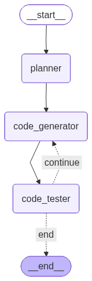

# Agent-as-coder_
# Agent_as_code_chaallenge
1.pip install -r requirements.txt
2..env GEMINI_API_kEY=""
3.python agent.py --target icici
4.WORKFLOW DIAGRAM

Planner Node: Determines the parsing strategy by analyzing input PDFs and corresponding CSV schemas.

Code Generator Node: Leverages Gemini AI to automatically write Python parser scripts.

Code Tester Node: Executes and verifies the parser against example data.

Self-Correction Loop: Refines the code automatically, retrying up to three times on failure.

VIDEO DEMO-14-41-53.mp4

